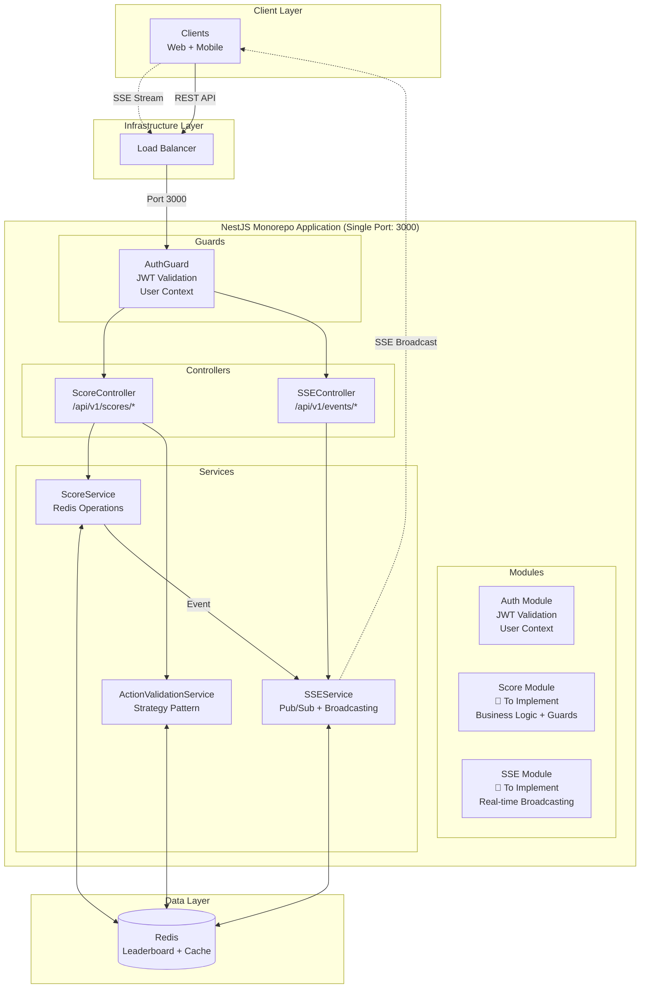
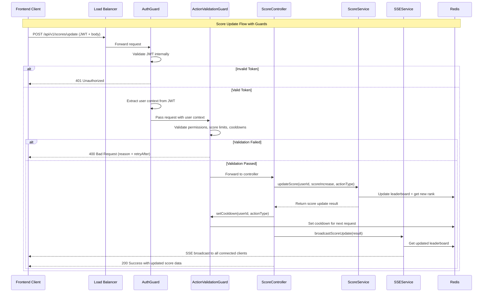

# Real-time Scoreboard API Module 🏆

## 📑 Table of Contents

- [Real-time Scoreboard API Module 🏆](#real-time-scoreboard-api-module-)
  - [📑 Table of Contents](#-table-of-contents)
  - [Overview](#overview)
  - [1. Functional Requirements](#1-functional-requirements)
    - [1.1 Core Requirements](#11-core-requirements)
    - [1.2 Dependencies \& Assumptions](#12-dependencies--assumptions)
    - [1.3 Out of Scope](#13-out-of-scope)
  - [2. Non-Functional Requirements](#2-non-functional-requirements)
  - [3. API Endpoints](#3-api-endpoints)
    - [3.1 Score Service APIs](#31-score-service-apis)
      - [Update Score](#update-score)
      - [Get Leaderboard](#get-leaderboard)
      - [Get User Score](#get-user-score)
    - [3.2 SSE Service APIs](#32-sse-service-apis)
      - [SSE Connection](#sse-connection)
    - [3.3 Data Models](#33-data-models)
  - [4. High Level Design](#4-high-level-design)
    - [4.1 System Architecture](#41-system-architecture)
    - [4.2 Technology Stack](#42-technology-stack)
    - [4.3 Module Structure](#43-module-structure)
  - [5. Guards \& Security](#5-guards--security)
    - [5.1 AuthGuard (JWT Validation)](#51-authguard-jwt-validation)
    - [5.2 ActionValidationGuard (Business Rules)](#52-actionvalidationguard-business-rules)
    - [5.3 Custom Decorators](#53-custom-decorators)
  - [6. Execution Flow](#6-execution-flow)
  - [7. Implementation Guide](#7-implementation-guide)
    - [7.1 Score Service Implementation](#71-score-service-implementation)
    - [7.2 SSE Service Implementation](#72-sse-service-implementation)
    - [7.3 Redis Data Structures](#73-redis-data-structures)
  - [8. Environment Configuration](#8-environment-configuration)
  - [9. Notes for Implementation Team](#9-notes-for-implementation-team)
    - [**Guard Pattern Benefits**](#guard-pattern-benefits)
    - [**Key Implementation Points**](#key-implementation-points)
    - [**Testing Strategy**](#testing-strategy)
    - [**Monitoring \& Alerting**](#monitoring--alerting)

---

## Overview

This document specifies **Score Module** and **SSE Module** for implementing a real-time scoreboard system using **NestJS modular monorepo architecture**. The system displays top 10 users' scores with live updates via Server-Sent Events, preventing malicious score manipulation through configurable action validation with Strategy Pattern.

**Architecture**: Single NestJS application with multiple modules, with clear separation between Guards, Modules, Controllers, and Services as shown in the system architecture.

---

## 1. Functional Requirements

### 1.1 Core Requirements

- **Score Module**: Handle score updates with validation and leaderboard management
- **SSE Module**: Real-time broadcasting of leaderboard updates to connected clients
- **Auth Module**: JWT validation and user context management
- **Strategy Pattern**: Flexible cooldown mechanisms (Fixed, Daily Reset, Sliding Window)
- **Guard-based Security**: AuthGuard for JWT validation and ActionValidationGuard for business rules

### 1.2 Dependencies & Assumptions

✅ **Internal Auth Service Implementation**:
- Provides JWT token validation using internal logic
- Returns user context with permissions from JWT payload
- Handles authentication/authorization within the application

✅ **Infrastructure Ready**:
- Redis instance available
- Load balancer configured
- NestJS project structure set up

### 1.3 Out of Scope

- ❌ **Authentication/Authorization**: Internal auth service handles this
- ❌ **User Management**: Registration, profiles, etc.
- ❌ **Action Implementation**: Actual user actions that generate scores
- ❌ **Business Logic Validation**: Domain-specific action verification

---

## 2. Non-Functional Requirements

- **API Response**: < 100ms (score updates), < 50ms (leaderboard reads)
- **Real-time Latency**: < 500ms end-to-end for SSE updates
- **Concurrent SSE**: Support 1000+ concurrent connections
- **Action Validation**: Configurable cooldowns and score limits per action type
- **Reliability**: Graceful handling of Redis/service failures

---

## 3. API Endpoints

### 3.1 Score Service APIs

#### Update Score
**`POST /api/v1/scores/update`**

```http
Authorization: Bearer <jwt_token>
Content-Type: application/json

{
  "actionType": "USER_ACTION",
  "scoreIncrease": 100
}
```

**Response**:
```json
{
  "success": true,
  "data": {
    "userId": "user_456",
    "previousScore": 1500,
    "newScore": 1600,
    "scoreIncrease": 100,
    "newRank": 7,
    "inTopTen": true
  }
}
```

#### Get Leaderboard
**`GET /api/v1/scores/leaderboard`**

```json
{
  "success": true,
  "data": {
    "leaderboard": [
      {
        "rank": 1,
        "userId": "user_456",
        "username": "PlayerOne",
        "score": 5000
      }
    ]
  }
}
```

#### Get User Score
**`GET /api/v1/scores/user/:userId`**

```json
{
  "success": true,
  "data": {
    "userId": "user_456",
    "username": "PlayerOne",
    "score": 1600,
    "rank": 7
  }
}
```

### 3.2 SSE Service APIs

#### SSE Connection
**`GET /api/v1/events/scoreboard`**

```http
Accept: text/event-stream
Authorization: Bearer <jwt_token>
```

**SSE Events**:

```
event: leaderboard_update
data: {
  "type": "leaderboard_update",
  "leaderboard": [...],
  "timestamp": "2025-09-05T10:30:00.000Z"
}

event: heartbeat
data: {
  "type": "heartbeat",
  "connectedClients": 847
}
```

### 3.3 Data Models

```typescript
// Core interfaces
interface ScoreUpdateRequest {
  actionType: string;
  scoreIncrease: number;
}

interface UserScore {
  userId: string;
  username: string;
  score: number;
  rank?: number;
}

interface ActionConfig {
  actionType: string;
  requiredPermission: string;
  maxScoreIncrease: number;
  cooldownType: 'FIXED' | 'DAILY_RESET' | 'SLIDING_WINDOW';
  enabled: boolean;

  // Strategy-specific configs
  cooldownSeconds?: number;
  windowSeconds?: number;
  maxActionsInWindow?: number;
  scoreLimitInWindow?: number;
}

// Internal auth service response
interface UserContext {
  userId: string;
  username: string;
  permissions: string[];
}
```

---

## 4. High Level Design

### 4.1 System Architecture



### 4.2 Technology Stack

**Monorepo Architecture**:
- **Single NestJS Application**: All modules in one app, single port (3000)
- **Layered Structure**: Guards → Controllers → Services with clear separation
- **In-memory Communication**: Direct service injection, no HTTP between modules

**Modules to Implement**:
- **Auth Module**: JWT validation service with internal authentication logic
- **Score Module**: Score updates, leaderboard management, action validation
- **SSE Module**: Real-time broadcasting via Server-Sent Events

**Dependencies (Already Available)**:
- **Redis**: Caching and data storage
- **Load Balancer**: Standard HTTP load balancing

### 4.3 Module Structure

```typescript
// app.module.ts - Main application module
@Module({
  imports: [
    ConfigModule.forRoot(),
    RedisModule.forRoot({
      host: process.env.REDIS_HOST,
      port: parseInt(process.env.REDIS_PORT),
    }),

    // Feature modules
    AuthModule,
    ScoreModule,
    SSEModule,
  ],
  controllers: [],
  providers: [],
})
export class AppModule {}

// auth.module.ts - Internal auth service module with guards
@Module({
  imports: [
    JwtModule.register({
      secret: process.env.JWT_SECRET,
      signOptions: { expiresIn: '1h' }
    }),
    ConfigModule
  ],
  providers: [
    AuthService,
    AuthGuard,
    ActionValidationService,
    ActionValidationGuard,
    CooldownStrategyFactory,

    // Strategies
    FixedCooldownStrategy,
    DailyResetStrategy,
    SlidingWindowStrategy,
  ],
  exports: [
    AuthService,
    AuthGuard,
    ActionValidationService,
    ActionValidationGuard
  ],
})
export class AuthModule {}

// score.module.ts
@Module({
  imports: [
    RedisModule,
    ConfigModule,
    AuthModule, // Import for guards and validation
  ],
  providers: [
    ScoreService,
  ],
  controllers: [ScoreController],
  exports: [ScoreService],
})
export class ScoreModule {}

// sse.module.ts
@Module({
  imports: [
    RedisModule,
    ConfigModule,
    AuthModule, // Import for AuthGuard
  ],
  providers: [
    SSEService,
  ],
  controllers: [SSEController],
  exports: [SSEService],
})
export class SSEModule {}
```

---

## 5. Guards & Security

### 5.1 AuthGuard (JWT Validation)

```typescript
// Internal auth service implementation
@Injectable()
export class AuthService {
  constructor(
    private jwtService: JwtService,
    private configService: ConfigService
  ) {}

  async validateToken(token: string): Promise<UserContext> {
    try {
      // Validate JWT token internally using jsonwebtoken or @nestjs/jwt
      const payload = this.jwtService.verify(token, {
        secret: this.configService.get('JWT_SECRET')
      });

      // Extract user context from JWT payload
      return {
        userId: payload.sub || payload.userId,
        username: payload.username,
        permissions: payload.permissions || []
      };
    } catch (error) {
      throw new UnauthorizedException('Invalid or expired token');
    }
  }
}

// AuthGuard - First layer protection
@Injectable()
export class AuthGuard implements CanActivate {
  constructor(private authService: AuthService) {}

  async canActivate(context: ExecutionContext): Promise<boolean> {
    const request = context.switchToHttp().getRequest();
    const token = this.extractTokenFromHeader(request);

    if (!token) {
      throw new UnauthorizedException('No token provided');
    }

    const userContext = await this.authService.validateToken(token);
    request.user = userContext; // Attach user to request
    return true;
  }

  private extractTokenFromHeader(request: any): string | undefined {
    const [type, token] = request.headers.authorization?.split(' ') ?? [];
    return type === 'Bearer' ? token : undefined;
  }
}
```

### 5.2 ActionValidationGuard (Business Rules)

**Purpose**: Prevent score abuse through configurable cooldowns and limits.

```typescript
// Action configuration interface
interface ActionConfig {
  actionType: string;
  requiredPermission: string;
  maxScoreIncrease: number;
  cooldownType: 'FIXED' | 'DAILY_RESET' | 'SLIDING_WINDOW';
  enabled: boolean;

  // Strategy-specific configs
  cooldownSeconds?: number;
  windowSeconds?: number;
  maxActionsInWindow?: number;
  scoreLimitInWindow?: number;
}

// Example configurations
const ACTION_CONFIGS: ActionConfig[] = [
  {
    actionType: 'USER_ACTION',
    requiredPermission: 'SCORE_UPDATE',
    maxScoreIncrease: 100,
    cooldownType: 'FIXED',
    cooldownSeconds: 30,
    enabled: true
  },
  {
    actionType: 'DAILY_QUEST',
    requiredPermission: 'SCORE_UPDATE',
    maxScoreIncrease: 500,
    cooldownType: 'DAILY_RESET',
    enabled: true
  },
  {
    actionType: 'COMPETITIVE_ACTION',
    requiredPermission: 'COMPETITIVE_SCORE',
    maxScoreIncrease: 200,
    cooldownType: 'SLIDING_WINDOW',
    windowSeconds: 3600, // 1 hour window
    maxActionsInWindow: 3,
    scoreLimitInWindow: 500,
    enabled: true
  }
];

// Strategy Pattern Implementation for Cooldown Management
interface CooldownStrategy {
  validate(
    userId: string,
    actionType: string,
    actionConfig: ActionConfig,
    redis: Redis
  ): Promise<{ valid: boolean; reason?: string; retryAfter?: number }>;

  setCooldown(
    userId: string,
    actionType: string,
    actionConfig: ActionConfig,
    redis: Redis
  ): Promise<void>;
}

// Fixed Cooldown Strategy
@Injectable()
export class FixedCooldownStrategy implements CooldownStrategy {
  async validate(
    userId: string,
    actionType: string,
    config: ActionConfig,
    redis: Redis
  ): Promise<{ valid: boolean; reason?: string; retryAfter?: number }> {
    const cooldownKey = `cooldown:${userId}:${actionType}`;
    const lastAction = await redis.get(cooldownKey);

    if (lastAction) {
      const timeSince = Date.now() - parseInt(lastAction);
      const cooldownMs = config.cooldownSeconds * 1000;

      if (timeSince < cooldownMs) {
        return {
          valid: false,
          reason: 'Action on cooldown',
          retryAfter: Math.ceil((cooldownMs - timeSince) / 1000)
        };
      }
    }

    return { valid: true };
  }

  async setCooldown(userId: string, actionType: string, config: ActionConfig, redis: Redis): Promise<void> {
    const cooldownKey = `cooldown:${userId}:${actionType}`;
    await redis.setex(cooldownKey, config.cooldownSeconds, Date.now().toString());
  }
}

// Daily Reset Strategy
@Injectable()
export class DailyResetStrategy implements CooldownStrategy {
  async validate(
    userId: string,
    actionType: string,
    config: ActionConfig,
    redis: Redis
  ): Promise<{ valid: boolean; reason?: string; retryAfter?: number }> {
    const dailyKey = `daily:${userId}:${actionType}:${this.getTodayKey()}`;
    const actionCount = await redis.get(dailyKey);

    if (actionCount && parseInt(actionCount) >= 1) {
      const tomorrow = new Date();
      tomorrow.setDate(tomorrow.getDate() + 1);
      tomorrow.setHours(0, 0, 0, 0);
      const retryAfter = Math.ceil((tomorrow.getTime() - Date.now()) / 1000);

      return {
        valid: false,
        reason: 'Daily action limit reached',
        retryAfter
      };
    }

    return { valid: true };
  }

  async setCooldown(userId: string, actionType: string, config: ActionConfig, redis: Redis): Promise<void> {
    const dailyKey = `daily:${userId}:${actionType}:${this.getTodayKey()}`;
    const tomorrow = new Date();
    tomorrow.setDate(tomorrow.getDate() + 1);
    tomorrow.setHours(0, 0, 0, 0);
    const ttlSeconds = Math.ceil((tomorrow.getTime() - Date.now()) / 1000);
    
    await redis.setex(dailyKey, ttlSeconds, '1');
  }

  private getTodayKey(): string {
    const today = new Date();
    return `${today.getFullYear()}-${today.getMonth() + 1}-${today.getDate()}`;
  }
}

// Sliding Window Strategy
@Injectable()
export class SlidingWindowStrategy implements CooldownStrategy {
  async validate(
    userId: string,
    actionType: string,
    config: ActionConfig,
    redis: Redis
  ): Promise<{ valid: boolean; reason?: string; retryAfter?: number }> {
    const windowKey = `window:${userId}:${actionType}`;
    const now = Date.now();
    const windowStart = now - (config.windowSeconds * 1000);

    // Remove old entries outside the sliding window
    await redis.zremrangebyscore(windowKey, '-inf', windowStart);

    // Get current actions in window
    const actionsInWindow = await redis.zcount(windowKey, windowStart, '+inf');
    const totalScoreResult = await redis.zrangebyscore(windowKey, windowStart, '+inf', 'WITHSCORES');
    
    // Calculate total score in window
    let totalScore = 0;
    for (let i = 1; i < totalScoreResult.length; i += 2) {
      totalScore += parseInt(totalScoreResult[i]);
    }

    // Check action count limit
    if (config.maxActionsInWindow && actionsInWindow >= config.maxActionsInWindow) {
      return {
        valid: false,
        reason: `Too many actions in sliding window (${actionsInWindow}/${config.maxActionsInWindow})`,
        retryAfter: config.windowSeconds
      };
    }

    // Check score limit
    if (config.scoreLimitInWindow && totalScore >= config.scoreLimitInWindow) {
      return {
        valid: false,
        reason: `Score limit exceeded in sliding window (${totalScore}/${config.scoreLimitInWindow})`,
        retryAfter: config.windowSeconds
      };
    }

    return { valid: true };
  }

  async setCooldown(userId: string, actionType: string, config: ActionConfig, redis: Redis): Promise<void> {
    const windowKey = `window:${userId}:${actionType}`;
    const now = Date.now();
    
    // Add current action to sliding window (score as the value)
    await redis.zadd(windowKey, now, `${now}:${config.maxScoreIncrease}`);
    
    // Set TTL on the key to prevent memory leaks
    await redis.expire(windowKey, config.windowSeconds + 60);
  }
}

// Factory for creating cooldown strategies
@Injectable()
export class CooldownStrategyFactory {
  constructor(
    private fixedStrategy: FixedCooldownStrategy,
    private dailyResetStrategy: DailyResetStrategy,
    private slidingWindowStrategy: SlidingWindowStrategy
  ) {}

  getStrategy(cooldownType: string): CooldownStrategy {
    switch (cooldownType) {
      case 'FIXED':
        return this.fixedStrategy;
      case 'DAILY_RESET':
        return this.dailyResetStrategy;
      case 'SLIDING_WINDOW':
        return this.slidingWindowStrategy;
      default:
        throw new Error(`Unknown cooldown strategy: ${cooldownType}`);
    }
  }
}

// Action validation service (Updated with Strategy Pattern)
@Injectable()
export class ActionValidationService {
  constructor(
    private redis: Redis,
    private cooldownStrategyFactory: CooldownStrategyFactory
  ) {}

  async validateAction(
    userId: string,
    actionType: string,
    scoreIncrease: number,
    userPermissions: string[]
  ): Promise<{ valid: boolean; reason?: string; retryAfter?: number }> {

    const config = this.getActionConfig(actionType);
    if (!config || !config.enabled) {
      return { valid: false, reason: 'Action type not allowed' };
    }

    // Check permissions
    if (!userPermissions.includes(config.requiredPermission)) {
      return { valid: false, reason: 'Insufficient permissions' };
    }

    // Check score limit
    if (scoreIncrease > config.maxScoreIncrease) {
      return {
        valid: false,
        reason: `Score increase exceeds maximum (${config.maxScoreIncrease})`
      };
    }

    // Use Strategy Pattern for cooldown validation
    const strategy = this.cooldownStrategyFactory.getStrategy(config.cooldownType);
    const cooldownValidation = await strategy.validate(userId, actionType, config, this.redis);

    if (!cooldownValidation.valid) {
      return cooldownValidation;
    }

    return { valid: true };
  }

  async setCooldown(userId: string, actionType: string): Promise<void> {
    const config = this.getActionConfig(actionType);
    if (config) {
      // Use Strategy Pattern for setting cooldown
      const strategy = this.cooldownStrategyFactory.getStrategy(config.cooldownType);
      await strategy.setCooldown(userId, actionType, config, this.redis);
    }
  }

  private getActionConfig(actionType: string): ActionConfig | null {
    return ACTION_CONFIGS.find(config => config.actionType === actionType) || null;
  }
}

// ActionValidationGuard - Second layer protection
@Injectable()
export class ActionValidationGuard implements CanActivate {
  constructor(private actionValidationService: ActionValidationService) {}

  async canActivate(context: ExecutionContext): Promise<boolean> {
    const request = context.switchToHttp().getRequest();
    const user = request.user; // Set by AuthGuard
    const body = request.body;

    if (!body.actionType || !body.scoreIncrease) {
      throw new BadRequestException('actionType and scoreIncrease are required');
    }

    const validation = await this.actionValidationService.validateAction(
      user.userId,
      body.actionType,
      body.scoreIncrease,
      user.permissions
    );

    if (!validation.valid) {
      throw new BadRequestException({
        message: validation.reason,
        retryAfter: validation.retryAfter
      });
    }

    return true;
  }
}
```

### 5.3 Custom Decorators

```typescript
// Extract user from request (set by AuthGuard)
export const CurrentUser = createParamDecorator(
  (data: unknown, ctx: ExecutionContext): UserContext => {
    const request = ctx.switchToHttp().getRequest();
    return request.user;
  }
);

// Skip action validation for specific endpoints
export const SkipActionValidation = () => SetMetadata('skipActionValidation', true);
```

---

## 6. Execution Flow



---

## 7. Implementation Guide

### 7.1 Score Service Implementation

```typescript
// score.controller.ts
@Controller('api/v1/scores')
export class ScoreController {
  constructor(
    private scoreService: ScoreService,
    private actionValidationService: ActionValidationService,
    private sseService: SSEService
  ) {}

  @Post('update')
  @UseGuards(AuthGuard, ActionValidationGuard)
  async updateScore(
    @Body() request: ScoreUpdateRequest,
    @CurrentUser() user: UserContext
  ) {
    // Guards have already validated auth, permissions, and cooldowns
    const result = await this.scoreService.updateScore(
      user.userId,
      user.username,
      request.scoreIncrease,
      request.actionType
    );

    // Set cooldown for next request
    await this.actionValidationService.setCooldown(user.userId, request.actionType);

    // Broadcast real-time update
    await this.sseService.broadcastScoreUpdate(result);

    return { success: true, data: result };
  }

  @Get('leaderboard')
  @UseGuards(AuthGuard)
  @SkipActionValidation()
  async getLeaderboard() {
    const leaderboard = await this.scoreService.getLeaderboard();
    return { success: true, data: { leaderboard } };
  }

  @Get('user/:userId')
  @UseGuards(AuthGuard)
  @SkipActionValidation()
  async getUserScore(@Param('userId') userId: string) {
    const userScore = await this.scoreService.getUserScore(userId);
    return { success: true, data: userScore };
  }
}

// score.service.ts
@Injectable()
export class ScoreService {
  constructor(private redis: Redis) {}

  async updateScore(
    userId: string,
    username: string,
    scoreIncrease: number,
    actionType: string
  ): Promise<ScoreUpdateResult> {
    // Get current score
    const currentScore = await this.redis.zscore('scores:leaderboard', userId) || 0;
    const newScore = currentScore + scoreIncrease;

    // Update leaderboard atomically
    const pipeline = this.redis.pipeline();
    pipeline.zadd('scores:leaderboard', newScore, userId);
    pipeline.hset('user:names', userId, username);
    await pipeline.exec();

    // Get new rank
    const newRank = await this.redis.zrevrank('scores:leaderboard', userId);

    return {
      userId,
      username,
      previousScore: currentScore,
      newScore,
      scoreIncrease,
      newRank: newRank + 1, // Convert to 1-based ranking
      inTopTen: newRank < 10
    };
  }

  async getLeaderboard(): Promise<UserScore[]> {
    const leaderboard = await this.redis.zrevrange(
      'scores:leaderboard',
      0, 9, // Top 10
      'WITHSCORES'
    );

    const result = [];
    for (let i = 0; i < leaderboard.length; i += 2) {
      const userId = leaderboard[i];
      const score = parseInt(leaderboard[i + 1]);
      const username = await this.redis.hget('user:names', userId);

      result.push({
        rank: Math.floor(i / 2) + 1,
        userId,
        username,
        score
      });
    }

    return result;
  }

  async getUserScore(userId: string): Promise<UserScore> {
    const score = await this.redis.zscore('scores:leaderboard', userId) || 0;
    const rank = await this.redis.zrevrank('scores:leaderboard', userId);
    const username = await this.redis.hget('user:names', userId);

    return {
      userId,
      username,
      score,
      rank: rank !== null ? rank + 1 : null
    };
  }
}
```

### 7.2 SSE Service Implementation

```typescript
// sse.controller.ts
@Controller('api/v1/events')
export class SSEController {
  constructor(
    private sseService: SSEService,
    private scoreService: ScoreService
  ) {}

  @Get('scoreboard')
  @UseGuards(AuthGuard)
  async streamScoreboard(
    @Req() req: Request,
    @Res() res: Response,
    @CurrentUser() user: UserContext
  ) {
    // Set SSE headers
    res.setHeader('Content-Type', 'text/event-stream');
    res.setHeader('Cache-Control', 'no-cache');
    res.setHeader('Connection', 'keep-alive');
    res.setHeader('Access-Control-Allow-Origin', '*');

    const clientId = `${user.userId}_${Date.now()}`;

    // Add connection tracking
    await this.sseService.addConnection(clientId, user.userId, res);

    // Send initial leaderboard
    const leaderboard = await this.scoreService.getLeaderboard();
    this.sseService.sendEvent(res, 'leaderboard_update', {
      leaderboard,
      timestamp: new Date().toISOString()
    });

    // Handle client disconnect
    req.on('close', () => {
      this.sseService.removeConnection(clientId);
    });

    req.on('error', () => {
      this.sseService.removeConnection(clientId);
    });
  }
}

// sse.service.ts
@Injectable()
export class SSEService implements OnModuleInit {
  private connections = new Map<string, Response>();

  constructor(
    private redis: Redis,
    private scoreService: ScoreService
  ) {}

  onModuleInit() {
    // Send heartbeat every 30 seconds
    setInterval(() => this.sendHeartbeat(), 30000);
  }

  async addConnection(clientId: string, userId: string, res: Response) {
    this.connections.set(clientId, res);

    // Track in Redis for monitoring
    await this.redis.setex(`sse:connection:${clientId}`, 300, userId);

    console.log(`SSE connection added: ${clientId}, total: ${this.connections.size}`);
  }

  removeConnection(clientId: string) {
    this.connections.delete(clientId);
    this.redis.del(`sse:connection:${clientId}`);

    console.log(`SSE connection removed: ${clientId}, total: ${this.connections.size}`);
  }

  async broadcastScoreUpdate(scoreUpdate: ScoreUpdateResult) {
    // Only broadcast if user is in top 10 or was in top 10
    if (scoreUpdate.inTopTen || scoreUpdate.newRank <= 15) {
      const leaderboard = await this.scoreService.getLeaderboard();

      this.broadcast('leaderboard_update', {
        leaderboard,
        updatedUser: scoreUpdate,
        timestamp: new Date().toISOString()
      });
    }
  }

  sendEvent(res: Response, event: string, data: any) {
    try {
      const eventData = `event: ${event}\ndata: ${JSON.stringify(data)}\n\n`;
      res.write(eventData);
    } catch (error) {
      console.error('Error sending SSE event:', error);
    }
  }

  private broadcast(event: string, data: any) {
    const eventData = `event: ${event}\ndata: ${JSON.stringify(data)}\n\n`;

    this.connections.forEach((res, clientId) => {
      try {
        res.write(eventData);
      } catch (error) {
        console.error(`Error broadcasting to ${clientId}:`, error);
        this.removeConnection(clientId);
      }
    });
  }

  private sendHeartbeat() {
    this.broadcast('heartbeat', {
      timestamp: new Date().toISOString(),
      connectedClients: this.connections.size
    });
  }
}
```

### 7.3 Redis Data Structures

```redis
# Leaderboard - Main data structure
# Type: Sorted Set (automatically sorted by score)
# Key: scores:leaderboard
# Score: user's total score, Member: userId
ZADD scores:leaderboard 5000 "user_456"
ZADD scores:leaderboard 4500 "user_789"
ZADD scores:leaderboard 3200 "user_123"

# Username mapping
# Type: Hash
# Key: user:names
# Field: userId, Value: username
HSET user:names user_456 "PlayerOne"
HSET user:names user_789 "GameMaster"

# Cooldown tracking (Strategy Pattern)
# Fixed Strategy - Type: String with TTL
# Key: cooldown:{userId}:{actionType}
# Value: timestamp of last action
# TTL: cooldown period in seconds
SET cooldown:user123:USER_ACTION 1725537000 EX 30

# Daily Reset Strategy - Type: String with TTL
# Key: daily:{userId}:{actionType}:{YYYY-MM-DD}
# Value: action count (always "1" for single daily action)
# TTL: seconds until next day
SET daily:user123:DAILY_QUEST:2025-9-6 "1" EX 43200

# Sliding Window Strategy - Type: Sorted Set with TTL
# Key: window:{userId}:{actionType}
# Score: timestamp, Member: "{timestamp}:{score}"
# TTL: window duration + buffer
ZADD window:user123:COMPETITIVE_ACTION 1725537000 "1725537000:200"
EXPIRE window:user123:COMPETITIVE_ACTION 3660

# SSE connection tracking (optional, for monitoring)
# Type: String with TTL
# Key: sse:connection:{clientId}
# Value: userId
# TTL: 5 minutes (cleanup if connection lost)
SET sse:connection:user123_1725537000 "user123" EX 300
```

**Redis Operations Examples:**

```bash
# Get top 10 leaderboard with scores
ZREVRANGE scores:leaderboard 0 9 WITHSCORES

# Get user's current rank (0-based, add 1 for display)
ZREVRANK scores:leaderboard user_456

# Get user's current score
ZSCORE scores:leaderboard user_456

# Check cooldowns for different strategies
# Fixed cooldown
GET cooldown:user123:USER_ACTION

# Daily reset cooldown
GET daily:user123:DAILY_QUEST:2025-9-6

# Sliding window - check actions in last hour
ZCOUNT window:user123:COMPETITIVE_ACTION 1725533400 +inf

# Sliding window - get all actions with scores in window
ZRANGEBYSCORE window:user123:COMPETITIVE_ACTION 1725533400 +inf WITHSCORES

# Clean up expired sliding window entries
ZREMRANGEBYSCORE window:user123:COMPETITIVE_ACTION -inf 1725533400

# Count total users in leaderboard
ZCARD scores:leaderboard
```

---

## 8. Environment Configuration

```env
# Application
APP_PORT=3000
NODE_ENV=production

# Internal Auth Service Configuration
JWT_SECRET=your-super-secure-jwt-secret-key
JWT_EXPIRES_IN=1h

# Redis Configuration
REDIS_HOST=localhost
REDIS_PORT=6379
REDIS_PASSWORD=
REDIS_DB=0

# Security Configuration
MAX_SCORE_INCREASE_PER_ACTION=1000
DEFAULT_COOLDOWN_SECONDS=30

# SSE Configuration
SSE_HEARTBEAT_INTERVAL=30000
SSE_CONNECTION_TIMEOUT=300000
SSE_MAX_CONNECTIONS=1000

# Monitoring
LOG_LEVEL=info
ENABLE_METRICS=true
```

---

## 9. Notes for Implementation Team

### **Guard Pattern Benefits**
- **Clean Controllers**: Business logic only, no auth/validation clutter
- **Reusable Security**: Guards can be applied to multiple endpoints
- **Early Validation**: Reject invalid requests before hitting business logic
- **Composable**: Stack multiple guards (Auth + ActionValidation)

### **Key Implementation Points**

1. **Guard Execution Order**:
   ```typescript
   @UseGuards(AuthGuard, ActionValidationGuard) // AuthGuard runs first
   ```

2. **Error Handling**: Guards throw descriptive exceptions
   ```typescript
   throw new BadRequestException({
     message: 'Action on cooldown',
     retryAfter: 25 // seconds
   });
   ```

3. **Redis Efficiency**: Use pipelines for atomic operations
   ```typescript
   const pipeline = this.redis.pipeline();
   pipeline.zadd('scores:leaderboard', newScore, userId);
   pipeline.hset('user:names', userId, username);
   await pipeline.exec();
   ```

4. **SSE Connection Management**: Always handle disconnections gracefully
   ```typescript
   req.on('close', () => this.sseService.removeConnection(clientId));
   req.on('error', () => this.sseService.removeConnection(clientId));
   ```

5. **Configuration Management**: Store action configs in code or database
   ```typescript
   // Can be moved to database for runtime changes
   const ACTION_CONFIGS: ActionConfig[] = [...]
   ```

### **Testing Strategy**
- **Unit Tests**: Test each guard independently with mocked dependencies
- **Integration Tests**: Test complete request flow with Redis
- **Load Tests**: Verify SSE handles target concurrent connections
- **Security Tests**: Attempt to bypass guards and cooldowns

### **Monitoring & Alerting**
- Track guard success/failure rates
- Monitor SSE connection counts
- Alert on unusual score patterns
- Track Redis performance metrics

This specification provides a comprehensive guide for implementing a robust, scalable, and secure real-time scoreboard system using NestJS modular monorepo architecture with guard-based security and configurable action validation strategies.
